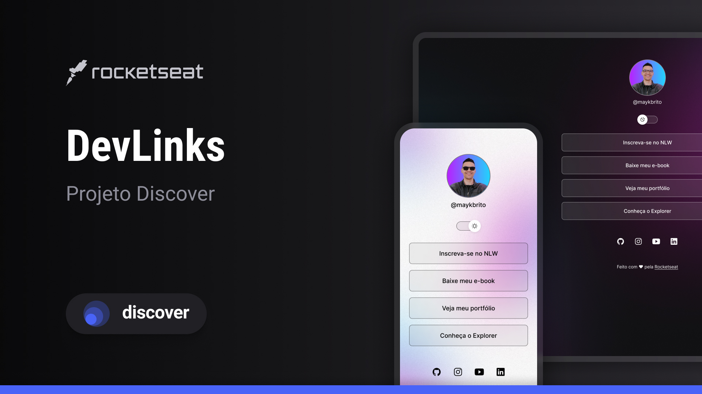

<h1 align="center"> Projeto Dev Links </h1>

 
Projeto Desenvolvido no Curso Discover da Rocketseat

 
  <a href="#-tecnologias">Tecnologias </a>

 
  <a href="#-projeto">Projeto </a>

 
  <a href="#-layout">Layout </a>

  

 

 

## Tecnologias

Esse projeto foi desenvolvido com as seguintes tecnologias:

-HTML e CSS

-JavaScript

-Git e Github

-Figma

## Projeto

O DevLinks é um agregrador de links para usar como cartão de visitas online.
